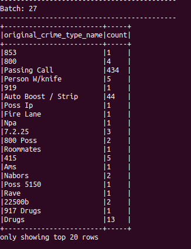
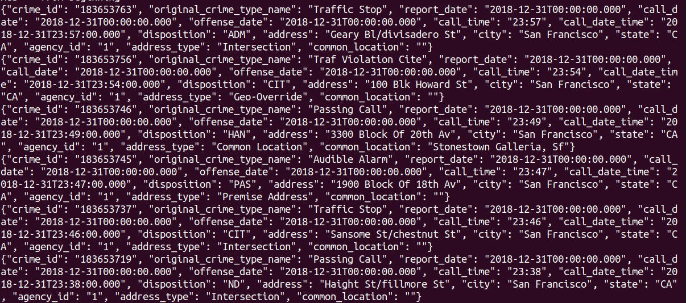
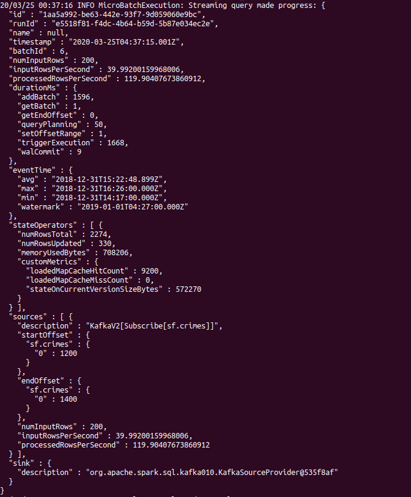
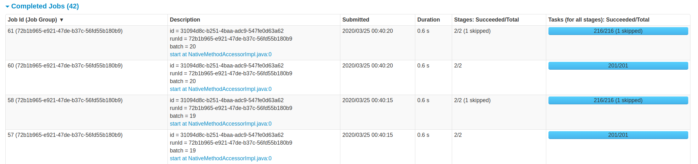
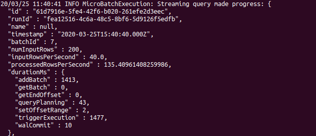
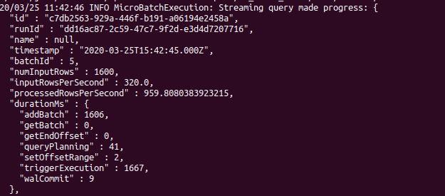
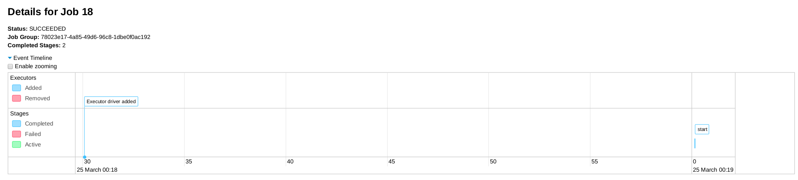
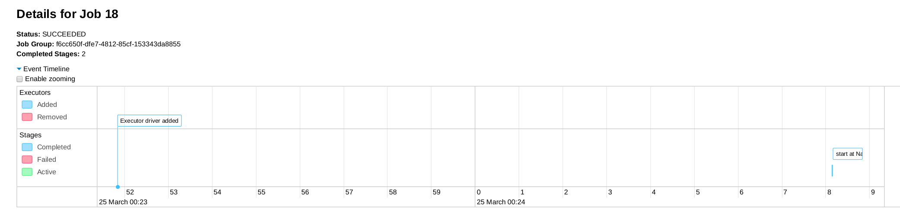

## San Francisco Crime Statistics with Spark Stream

The San Francisco Crime data was (or are being) collected as a json log file. The goal of project was to use Spark Structured Stream, process data as live stream and then export an aggregate new stream that can be used for  live analytics.  I used Kafka producer to produce streaming data.  Instead of using Kafka consumer to process data, I used Spark to consume and process data because Spark RDD based structure that is fault tolerance, distributed and partitioned.  Spark also comes with SQL and streaming functionalities to process and aggregate streaming data.  The resulting aggregated stream can provide insights from the data.  In this case, we aggregate data by counting number of crimes in different categories of crimes.  




### Dataset:

(1) police-department-calls-for-service.json
(2) radio_code.json


### Requirement:

(1) requirements.txt

(2) Install requirement
run ./start.sh at terminal or pip install -r requirements.txt

### Development Environment:
I developed the project locally as described below:
    • Spark 2.4.5 (version 2.4.3 and kafka_2.11_2.3.0 gave me error with trigger.processingTime=5 or “5 SECONDS”, that I couldn’t resolve 
      
it (could be due my local environment with other programs installed))

    • Scala 2.12 (instead of 2.11)
    
    • Java 1.8.x
    
    • Kafka build with Scala 2.12 version 2.3
    
    • Python 3.7.4

### Python code files:

(1) producer_server.py

KafkaProducer can be used to send message to a topic. 

(2) kafka_server.py
Use KafkaProducer to produce data into a Kafka topic (“sf.crimes”) from the data source (police-department-calls-for-service.json).

(3) data_stream.py
Use Spark as stream consumer to ingest data stream from Kafka topic (“sf.crimes”), then export intermediate Spark stream and aggregate data to produce stream (with writestream) to kafka data sink.

(4) consumer_server.py
Use confluent_kafka Consumer to check if messages were produced into “sf.crimes” topic by the KafkaProducer.

### Run the code:

(1) Running zookeeper:

./bin/zookeeper-server-start.sh config/zookeeper.properties

(2) Running kafka-server: 

./bin/kafka-server-start.sh config/server.properties

(3) Produce messages to kafka-topic:

python kafka_server.py

(4) Use Kafka consumer to check messages in the topic (topic: sf.crimes):

./bin/kafka-console-consumer.sh --bootstrap-server localhost:9092 --topic sf.crimes --from-beginning

The follow screenshot shows messages were produced into the topic.



(5) Run Spark stream:

spark-submit --packages org.apache.spark:spark-sql-kafka-0-10_2.11:2.4.0 --master local[*] path_to data_stream.py



(6) Spark Web UI:

IP-address:4040
4040 is the default port.  It can be configured to use other ports.  



### 1. How did changing values on the SparkSession property parameters affect the throughput and latency of the data?
Increasing “maxOffsetsPerTrigger” can increase “processedRowsPerSecond”.

Decreasing trigger.processingTime can decrease latency between “Executor driver added” and start of execution (see below).

### 2. What were the 2-3 most efficient SparkSession property key/value pairs? Through testing multiple variations on values, how can you tell these were the most optimal?

#### (1) Changing “maxOffsetsPerTrigger” seems to efficient SparkSession property
      
with maxRatePerPartition = 20

* At “maxOffsetsPerTrigger” = 200, “processedRowsPerSecond” is around 130




* At “maxOffsetsPerTrigger” = 400, “processedRowsPerSecond” is around 230

* At “maxOffsetsPerTrigger” = 600, “processedRowsPerSecond” is around 330

* At “maxOffsetsPerTrigger” = 800, “processedRowsPerSecond” is around 500

* At “maxOffsetsPerTrigger” = 1600, “processedRowsPerSecond” is around 900



* At “maxOffsetsPerTrigger” = 5000, “processedRowsPerSecond” is around 900

Therefore “maxOffsetsPerTrigger” = 1600 is close to be optimized.
      
#### (2) Another efficient SparkSession property is trigger.processingTime 
trigger.processingTime = 5 seconds:
From “Executor driver added” to "start of execution" is also around 30 seconds



trigger.processingTime = 2 seconds:
From “Executor driver added” to "start of execution" is around 16-17 seconds




* Therefore, lower trigger.processingTime decreases latency of the execution.

* trigger.processingTime = 1 second:

* From “Executor driver added” to "start of execution" is around 15.5 seconds

* Trigger.processingTime = 1 second or 2 seconds got very close results.  Therefore , the optimum is around 1 to 2 seconds.  I set  maxOffsetsPerTrigger” = 200 in these experiments.


```python

```
